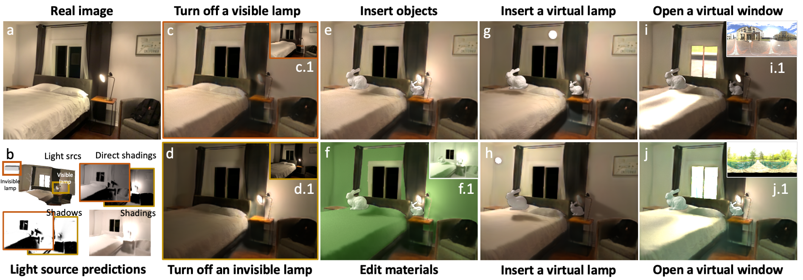
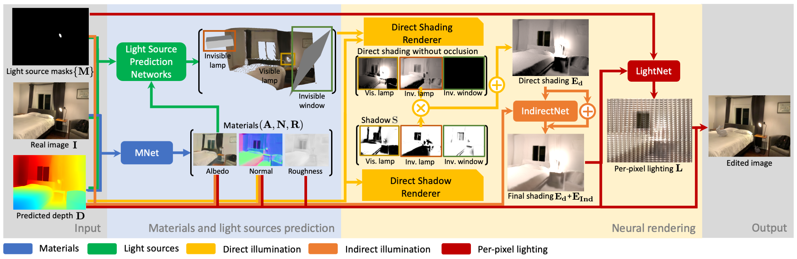

# Physically-based Editing of Indoor Scene Lighting from a Single Image

Zhengqin Li, Jia Shi, Sai Bi, Rui Zhu, Kalyan Sunkavalli, Miloš Hašan, Zexiang Xu, Ravi Ramamoorthi, Manmohan Chandraker



## Related links:
* [Trained models](https://drive.google.com/drive/folders/1jIaDIKKf3R_EpeMrxobA_HOMWO8D3W0C?usp=sharing)
* [Object insertion](https://github.com/lzqsd/VirtualObjectInsertion)
* [Dataset](https://ucsd-openrooms.github.io/)
* [Arxiv](https://arxiv.org/abs/2205.09343)

## Dependencies
We highly recommend using Anaconda to manage python packages. Required dependencies include:
* [pytorch](https://pytorch.org/)
* [pytorch3D](https://pytorch3d.org/)
* [OpenCV](https://opencv.org/)
* [Open3D](http://www.open3d.org/)
* [Nvidia Optix 5.11 - 6.0](https://developer.nvidia.com/designworks/optix/downloads/legacy)

## Train and test models on the OpenRooms dataset



1. Download the [OpenRooms dataset](https://ucsd-openrooms.github.io/). 
2. Compile Optix-based shadow renderer with python binding. 
      * Go to [OptixRendererShadow](OptixRendererShadow) directory. Compile the code following this [link](https://github.com/lzqsd/OptixRenderer.git). 
3. Modify the pytorch3D code to support RMSE chamfer distance loss.
      * Go to [chamfer.py](https://github.com/facebookresearch/pytorch3d/blob/main/pytorch3d/loss/chamfer.py). 
      * Add flag `isRMSE = False` to function `chamfer_distance`.
      * Modify function `chamfer_distance` by adding lines below after the definition of `cham_x` and `cham_y`.
      ```python
      if isRMSE == True:
          cham_x = torch.sqrt(cham_x + 1e-6)
          cham_y = torch.sqrt(cham_y + 1e-6)
      ```
4. Train models. 
     * Train the material prediction network. 
     ```python
     python trainBRDF.py           # Train material prediction.
     ```
     * Train light source prediction networks.
     ```python
     python trainVisLamp.py        # Train visible lamp prediction.
     python trainVisWindow.py      # Train visible window prediction.
     python trainInvLamp.py        # Train invisible lamp prediction.
     python trainInvWindow.py      # Train invisible window prediction.
     ```
     * Train the neural renderer.
     ```python
     python trainShadowDepth.py --isGradLoss      # Train shadow prediction.
     python trainDirectIndirect.py                # Train indirect illumination prediction.
     python trainPerpixelLighting.py              # Train perpixel lighting prediction.
     ```
5. Test models.
     * Test the material prediction network.
     ```python
     python testBRDF.py            # Test BRDF prediction. Results in Table 5 in the supp.
     ```
     * Test light source prediction networks.
     ```python
     python testVisLamp.py         # Test visible lamp prediction. Results in Table 3 in the main paper.
     python testVisWindow.py       # Test visible window prediction. Results in Table 3 in the main paper. 
     python testInvLamp.py         # Test invisible lamp prediction. Results in Table 3 in the main paper.
     python testInvWindow.py       # Test invisible window prediction. Results in Table 3 in the main paper.
     ```
     * Test the neural renderer.
     ```python
     python testShadowDepth.py --isGradLoss       # Test shadow prediction. Results in Table 2 in the main paper. 
     python testDirectIndirect.py                 # Test indirect illumination prediction. 
     python testPerpixelLighting.py               # Test perpixel lighting prediction. 
     python testFull.py                           # Test the whole neural renderer with predicted light sources. Results in Table 4 in the main paper. 
     ```
    
## Scene editing applications on real images
1. Prepare input data. 
     * Create a root folder, e.g. `Example1`. 
     * Create a folder `Example1/input` for input data. The folder should include:
          * `image.png`:
          * `envMask.png`: 
          * `lampMask_x.png`:
          * `winMask_x.png`:
     * Create `testList.txt`. Add absolute path of `Example1` to its first line. 
3. Depth prediction.
     * Download [DPT](https://github.com/isl-org/DPT) and save it in folder `DPT`
     * Run python script `testRealDepth.py`
     ```python
     python testRealDepth.py --testList testList.txt
     ```
5. Material and light source prediction.
     * Run python script `testRealBRDFLight.py`. Please add flag `--isOptimize` to improve quality.
     ```python
     python testRealBRDFLight.py --testList testList.txt --isOptimize
     ```
6. Edit light sources, geometry or materials.
     * We prepare a list of edited examples from our teaser figure.
          * Example1_changeAlbedo:
          * Example1_addObject:
          * Example1_addWindow_turnOffPredLamps:
          * Example1_addLamp_turnOffPredLamps:
          * Example1_turnOffVisLamp:
          * Example1_turnOffInvLamp:
     * Please check `README.md` inside each folder to see how to generate results. To reproduce results in teaser, you may need to combine several editing operations together. 
7. Rerender the image with the neural renderer.
     * Run python script `testRealRender.py`. You may need to specify `--objName` when inserting virtual object. You may need to specify `--isVisLampMesh` when inserting virtual lamps. You may need to specify `--isPerpixelLighting` to predict perpixel environment map, which is used to render specular bunnies on the [Garon et al. dataset](http://indoorsv.hdrdb.com/)
     ```python
     python testRealRender.py --is
     ```
     
